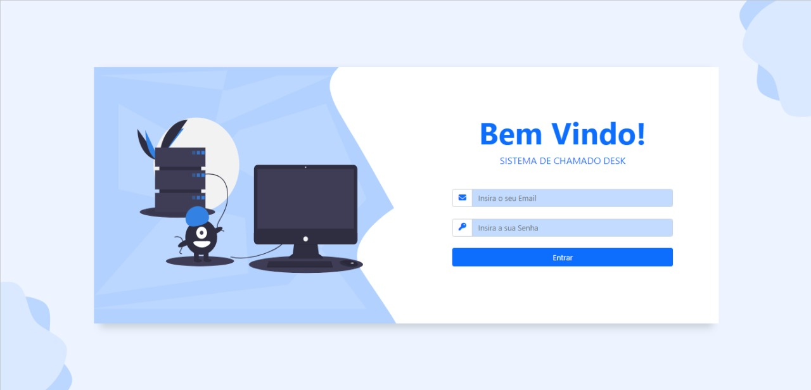
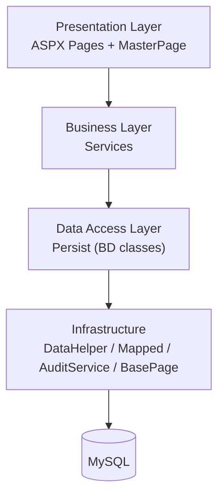
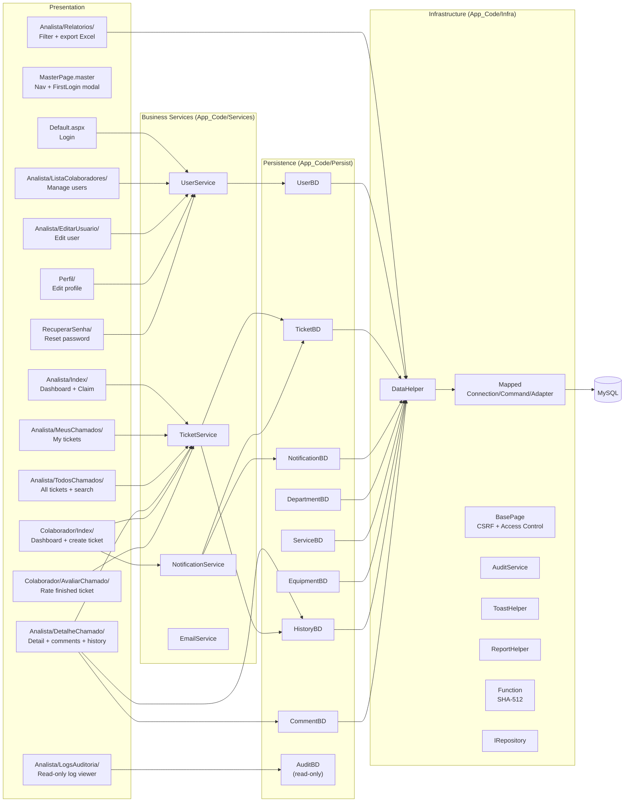
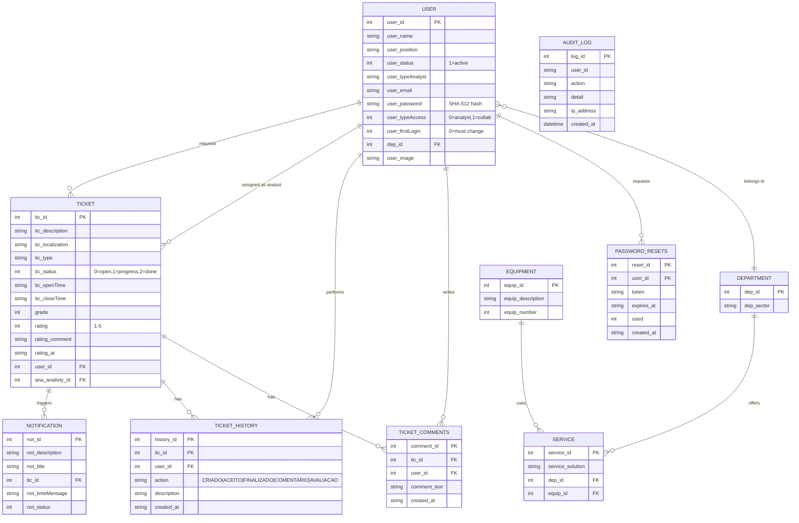
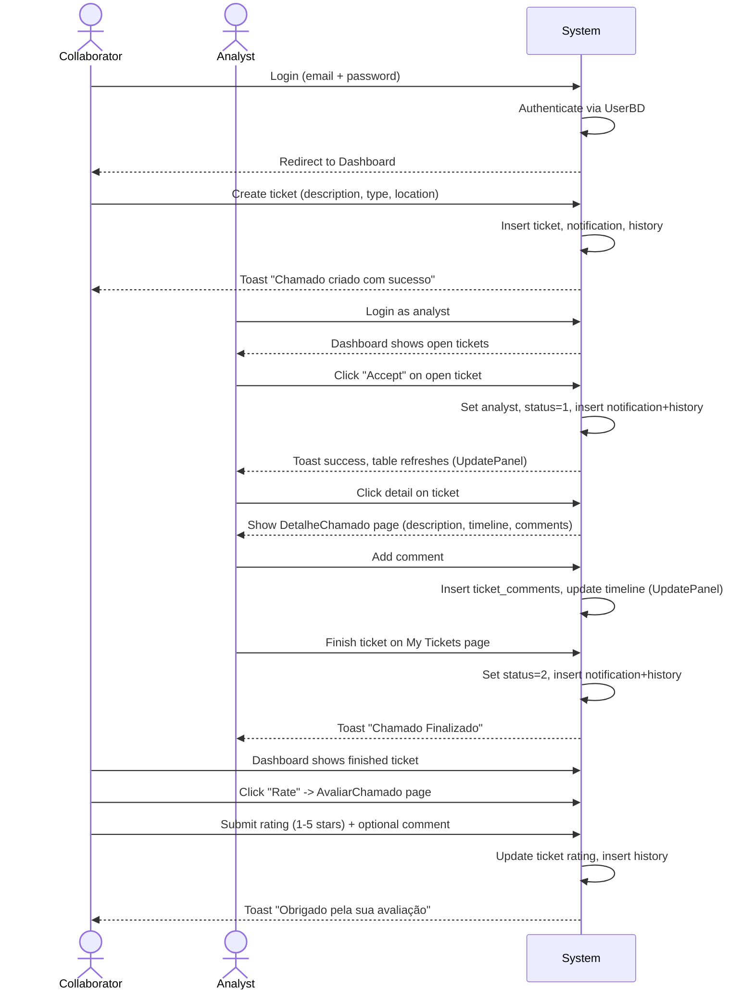
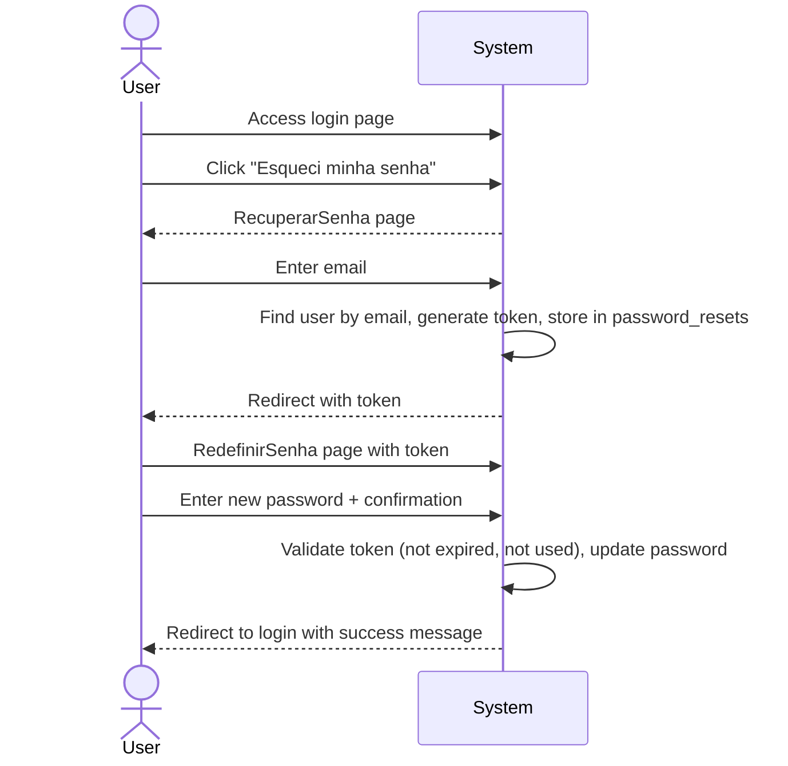
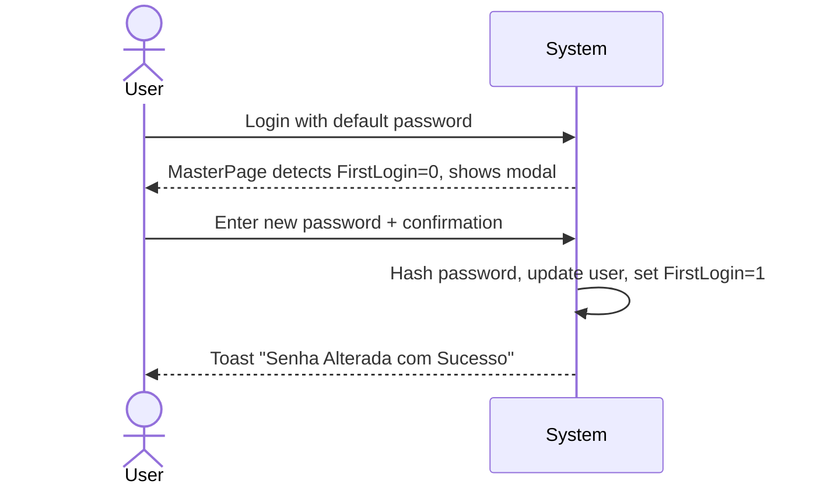

# GCDesk



Sistema de gestão de chamados para colaboradores e analistas de TI.  
Permite abertura, acompanhamento, resolução e avaliação de chamados técnicos.

---

## Architecture

### Layered design

The application follows a strict 3-layer architecture plus a utility layer, all written in C# with ASP.NET Web Forms (.NET Framework 4.8).



| Layer              | Directory            | Responsibility                                                                                                                              |
| ------------------ | -------------------- | ------------------------------------------------------------------------------------------------------------------------------------------- |
| **Presentation**   | `Pages/`             | ASPX markup, code-behind, MasterPage layout, toast notifications                                                                            |
| **Business**       | `App_Code/Services/` | Orchestrates business rules, calls Persist, emits audit/history/notifications                                                               |
| **Data Access**    | `App_Code/Persist/`  | `IRepository<T>` implementations, raw SQL via `DataHelper`                                                                                  |
| **Infrastructure** | `App_Code/Infra/`    | `DataHelper`, `Mapped` (ADO.NET factory), `AuditService`, `ToastHelper`, `ReportHelper`, `BasePage`, `Function` (hashing), `IRepository<T>` |
| **Domain**         | `App_Code/Class/`    | Plain entity classes (User, Ticket, Notification, Department, Equipment, Service)                                                           |

---

## Component diagram



---

## Database schema (ER)



---

## User flows

### 1. Ticket lifecycle



### 2. Account recovery



### 3. First login (password change)



---

## Page routing

| Page              | URL                                                           | Access    | Purpose                        |
| ----------------- | ------------------------------------------------------------- | --------- | ------------------------------ |
| Login             | `/Default.aspx`                                               | Public    | Authenticate                   |
| Analyst Dashboard | `/Pages/Sistema/Analista/Index/Default.aspx`                  | Analyst 0 | Charts + accept tickets        |
| My Tickets        | `/Pages/Sistema/Analista/MeusChamados/Default.aspx`           | Analyst 0 | Progress/finish                |
| All Tickets       | `/Pages/Sistema/Analista/TodosChamados/Default.aspx`          | Analyst 0 | Search + browse                |
| Ticket Detail     | `/Pages/Sistema/Analista/DetalheChamado/Default.aspx?id=N`    | Analyst 0 | View + comment + history       |
| Manage Users      | `/Pages/Sistema/Analista/ListaColaboradores/Default.aspx`     | Analyst 0 | Create/delete/activate users   |
| Edit User         | `/Pages/Sistema/Analista/EditarUsuario/Default.aspx`          | Analyst 0 | Edit user fields               |
| Reports           | `/Pages/Sistema/Analista/Relatorios/Default.aspx`             | Analyst 0 | Filter + export XLS            |
| Audit Log         | `/Pages/Sistema/Analista/LogsAuditoria/Default.aspx`          | Analyst 0 | Read-only log viewer + filters |
| Collab Dashboard  | `/Pages/Sistema/Colaborador/Index/Default.aspx`               | Collab 1  | Create ticket + summary        |
| Rate Ticket       | `/Pages/Sistema/Colaborador/AvaliarChamado/Default.aspx?id=N` | Collab 1  | Rate finished                  |
| Profile           | `/Pages/Sistema/Perfil/Default.aspx`                          | Any       | Edit name/email/pass           |
| Forgot Password   | `/Pages/RecuperarSenha/Default.aspx`                          | Public    | Request reset                  |
| Reset Password    | `/Pages/RedefinirSenha/Default.aspx?token=T`                  | Public    | Execute reset                  |
| Error 400         | `/Pages/PageError/Error400.aspx`                              | Public    | Bad request                    |
| Error 403         | `/Pages/PageError/Error403.aspx`                              | Public    | Forbidden / access denied      |
| Error 404         | `/Pages/PageError/Error404.aspx`                              | Public    | Page not found                 |
| Error 500         | `/Pages/PageError/Error.aspx`                                 | Public    | Internal server error          |

---

## How to run

### Docker (recommended)

```bash
docker compose up -d --build
```

- Web: http://localhost:8080
- MySQL: localhost:3306 (user `root`, password `root`, database `base`)

### Manual (requires Mono + MySQL)

```bash
# 1. Restore NuGet packages
nuget restore packages.config -PackagesDirectory packages
mkdir -p bin
cp packages/MySql.Data.8.0.29/lib/net48/MySql.Data.dll bin/
cp packages/Ubiety.Dns.Core.2.2.1/lib/netstandard2.0/Ubiety.Dns.Core.dll bin/

# 2. Configure Web.config (replace ${DB_HOST}, ${DB_USER}, ${DB_PASS})
# 3. Run with xsp4
xsp4 --port 80 --nonstop
```

### Default users

| Email               | Password   | Role            |
| ------------------- | ---------- | --------------- |
| `admin@gcdesk.com`  | `admin123` | Analyst (admin) |
| `ana@gcdesk.com`    | `123456`   | Analyst         |
| `carlos@gcdesk.com` | `123456`   | Analyst         |
| `joao@gcdesk.com`   | `123456`   | Collaborator    |
| `maria@gcdesk.com`  | `123456`   | Collaborator    |
| `pedro@gcdesk.com`  | `123456`   | Collaborator    |
| `julia@gcdesk.com`  | `123456`   | Collaborator    |
| `lucas@gcdesk.com`  | `123456`   | Collaborator    |

> On first login with any `123456` user, the system forces a password change.

---

## Key design decisions

| Decision                  | Rationale                                                                                                                                      |
| ------------------------- | ---------------------------------------------------------------------------------------------------------------------------------------------- |
| **`IRepository<T>`**      | Single CRUD contract for all entities; Persist classes also expose static methods for DataSet-based queries                                    |
| **`DataHelper`**          | Eliminates repeated connection/command/dispose boilerplate; filters null params automatically                                                  |
| **`BasePage`**            | Every page inherits CSRF protection (`ViewStateUserKey`), access control, and audit logging                                                    |
| **`UpdatePanel`**         | Async postbacks for table actions (delete/activate/claim/comment) without full page reload                                                     |
| **SHA-512 hashing**       | Passwords stored as Base64 SHA-512 hashes; `Function.HashText()` is the single hash entry point                                                |
| **ToastHelper**           | Centralized Bootstrap toast markup for success/warning/error messages                                                                          |
| **Static Map methods**    | Each Persist class maps `IDataReader` rows to entities; `HasColumn()` handles optional rating columns                                          |
| **Mixed static/instance** | Static methods used for simple reads/writes where no instance state is needed; instance methods used for `IRepository<T>` interface compliance |

---

## Security controls

- **CSRF**: Anti-forgery token stored in session + `ViewStateUserKey`, validated on every postback (`BasePage.cs:29`)
- **Access control**: `RequiredAccessType` abstract property enforces role-based access per page (`BasePage.cs:57`)
- **CSP**: Content-Security-Policy header set in `Global.asax` with whitelisted CDN origins
- **X-Frame-Options**: `DENY` to prevent clickjacking
- **X-Content-Type-Options**: `nosniff` to prevent MIME sniffing
- **SQL injection**: All queries use parameterized statements via `Mapped.Parameter()`
- **Audit trail**: All user actions (login, logout, ticket create/accept/finish, comment, rate, user create/deactivate/activate/update, profile update, report export, access denials, CSRF failures) are logged to `audit_log` via `AuditService` + `BasePage.LogAction`

- **Audit log viewer**: `/Pages/Sistema/Analista/LogsAuditoria/Default.aspx` is **read-only** (no mutations allowed) and supports filtering by action, user id, and date range
- **Session timeout**: 30 minutes (`InProc` mode)

---

## Project structure

```
├── App_Code/
│   ├── Class/           # Domain entities
│   ├── Infra/           # Cross-cutting infrastructure
│   │   ├── DataHelper.cs    # ADO.NET wrapper
│   │   ├── Mapped.cs        # MySQL connection/command/parameter factory
│   │   ├── BasePage.cs      # CSRF + access control base class
│   │   ├── AuditService.cs  # Audit trail logging
│   │   ├── ToastHelper.cs   # Bootstrap toast builder
│   │   ├── ReportHelper.cs  # HTML/Excel export
│   │   ├── Function.cs      # SHA-512 hashing
│   │   └── IRepository.cs   # Generic CRUD interface
│   ├── Persist/         # Data access (IRepository<T> + static helpers)
│   │   └── AuditBD.cs       # Read-only audit_log queries
│   └── Services/        # Business logic
├── css/                 # Custom styles
├── db/init.sql          # Schema + seed data
├── image/               # Static assets (logos, backgrounds, error page SVGs)
├── js/                  # Custom scripts
├── uploads/             # User uploaded files (profile images — UUID filenames)
├── Pages/
│   ├── Master/          # MasterPage (layout + nav)
│   ├── PageError/       # Error pages (400, 403, 404, 500)
│   └── Sistema/
    │       ├── Analista/    # Dashboard, MeusChamados, TodosChamados, DetalheChamado, ListaColaboradores, EditarUsuario, Relatorios, LogsAuditoria
    │       ├── Colaborador/ # Index, AvaliarChamado
    │       └── Perfil/
    │   ├── RecuperarSenha/
    │   └── RedefinirSenha/
├── Default.aspx         # Login page
├── Global.asax          # CSP headers + app events
├── Web.config           # App settings, security, compilation
├── packages.config      # NuGet dependencies
├── Dockerfile           # Mono + xsp4 image
└── docker-compose.yml   # Web + MySQL orchestration
```
